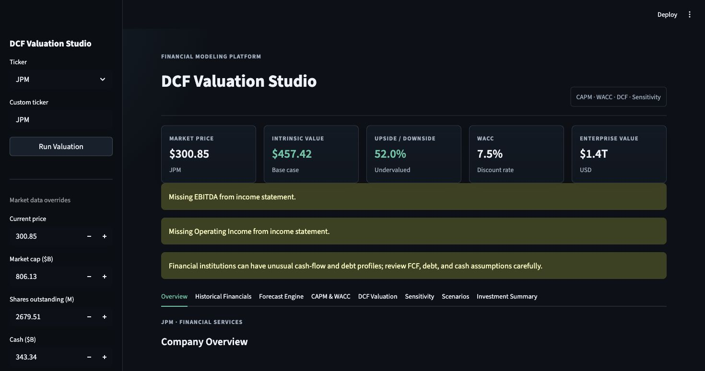

# DCF Valuation Studio

DCF Valuation Studio is a professional Streamlit dashboard for building discounted cash flow valuations from real public-company data. It combines ticker-level data ingestion, historical financial analysis, forecasting, CAPM, WACC, terminal value math, sensitivity analysis, scenario analysis, valuation bridges, and Excel export in a clean finance-dashboard interface.

The project is designed to show that a motivated student can build more than a formula sheet: this is a small but complete valuation platform with separated business logic, tests, CI, documentation, and a polished user experience.

## Features

- Pulls company profile, price, market capitalization, enterprise value, beta, shares outstanding, cash, debt, and annual financial statements with `yfinance`
- Normalizes revenue, EBITDA, operating income, net income, and free cash flow across statement formats
- Calculates CAPM cost of equity from risk-free rate, beta, and market risk premium
- Calculates WACC using market-value equity, debt, cost of equity, after-tax cost of debt, and tax rate
- Forecasts revenue, EBITDA, operating income, and free cash flow with editable growth and margin assumptions
- Calculates present value of forecast cash flows, terminal value, enterprise value, equity value, and intrinsic value per share
- Compares intrinsic value to current market price with neutral valuation language
- Builds discount-rate / terminal-growth sensitivity matrices with a professional heatmap
- Runs Bear, Base, and Bull scenarios with probability-weighted valuation
- Creates valuation waterfall from enterprise value to equity value per share
- Exports the full model to Excel
- Includes pytest coverage and GitHub Actions CI

## Methodology

The platform uses a standard enterprise-value DCF workflow:

1. Gather company data and annual historical financial statements.
2. Forecast revenue and operating margins over a selected horizon.
3. Estimate future free cash flows.
4. Calculate cost of equity with CAPM.
5. Calculate WACC from equity, debt, financing costs, and tax rate.
6. Discount projected cash flows using WACC.
7. Estimate terminal value with the Gordon Growth method.
8. Convert enterprise value to equity value by subtracting debt and adding cash.
9. Divide equity value by shares outstanding.
10. Compare intrinsic value per share with market price.

## Financial Concepts

### DCF

A discounted cash flow valuation estimates what a business is worth today based on the present value of future cash flows. The model separates explicit forecast cash flows from terminal value, which captures value after the forecast period.

### CAPM

The Capital Asset Pricing Model estimates cost of equity:

```text
Cost of Equity = Risk-Free Rate + Beta x Market Risk Premium
```

### WACC

Weighted Average Cost of Capital blends equity and debt financing costs:

```text
WACC = (E / V x Re) + (D / V x Rd x (1 - Tax Rate))
```

### Sensitivity Analysis

DCF outputs are highly sensitive to discount rate and terminal growth. The app builds a two-way matrix so users can see how intrinsic value changes across reasonable assumption ranges.

### Scenario Analysis

The dashboard runs Bear, Base, and Bull cases around the active assumptions. Each scenario adjusts growth, margins, discount rate, and terminal growth, then shows the valuation range and probability-weighted output.

## JPMorgan Chase Example

Snapshot source data as of June 2, 2026:

- Market price: `$300.96`
- Market capitalization: `$806.43B`
- TTM revenue: `$173.56B`
- Net income: `$57.51B`
- Shares outstanding: `2.68B`
- Beta: `1.02`

Because JPMorgan Chase is a bank, its reported debt, cash, and free-cash-flow lines do not behave like an industrial company’s capital structure. This example uses a normalized bank-style cash-flow proxy based on net income margin, while the app still supports the standard DCF controls for any ticker.

Example assumptions:

- Forecast horizon: `5 years`
- Revenue growth: fades from `3.0%` to `2.5%`
- Normalized cash-flow margin: `33.1%`
- Risk-free rate: `4.25%`
- Market risk premium: `5.50%`
- Beta: `1.02`
- WACC: `9.86%`
- Terminal growth: `2.50%`

Example result:

- Intrinsic value per share: `$302.27`
- Market price: `$300.96`
- Implied upside/downside: `+0.4%`
- Model conclusion: `Fairly valued`

This is a valuation exercise, not investment advice. Small changes to WACC, terminal growth, or cash-flow margins can materially change the conclusion.

## Screenshots



Suggested additional captures:

- Company overview and top valuation metrics
- Historical financials tab
- DCF valuation waterfall
- Sensitivity heatmap
- Scenario analysis range

## Installation

```bash
python3 -m venv .venv
source .venv/bin/activate
pip install -e ".[dev]"
```

## Usage

```bash
streamlit run app.py
```

Open the local Streamlit URL, enter a ticker, review the pulled financial data, adjust assumptions, and export the workbook from the Investment Summary tab.

## Testing

```bash
pytest
ruff check .
black --check .
```

## Repository Structure

```text
.
├── app.py
├── assets/
├── notebooks/
├── screenshots/
├── src/
│   └── dcf_studio/
├── tests/
└── .github/
    └── workflows/
```

## Limitations

- `yfinance` data availability varies by ticker and may change over time.
- Free cash flow for banks, insurers, and other financial institutions can be difficult to interpret in a standard enterprise-value DCF.
- The model does not provide investment advice or price targets.
- Outputs depend heavily on user assumptions.
- Currency and cross-listing issues may require manual review for non-U.S. tickers.

## Future Improvements

- Add dedicated financial-institution valuation modes such as excess-return or dividend discount models
- Add peer valuation multiples
- Add Monte Carlo simulation
- Add saved scenario presets
- Add SEC filing ingestion
- Add screenshot generation workflow for README assets

## References

- [JPMorgan Chase price and key stats, StockAnalysis](https://stockanalysis.com/stocks/jpm/)
- [JPMorgan Chase price and market stats, MarketBeat](https://www.marketbeat.com/stocks/NYSE/JPM/)
- [yfinance documentation](https://github.com/ranaroussi/yfinance)
- [Streamlit documentation](https://docs.streamlit.io/)
- [Plotly Python documentation](https://plotly.com/python/)

## License

MIT License. See `LICENSE`.
