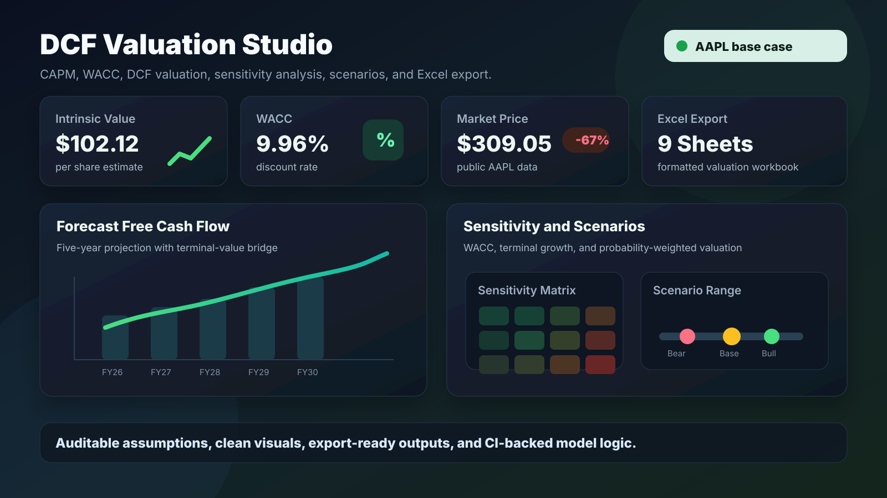

# DCF Valuation Studio

DCF Valuation Studio is a Streamlit app for building discounted cash flow valuations from public-company data. It pulls financial statements, forecasts free cash flow, estimates CAPM and WACC, runs sensitivity and scenario analysis, and converts enterprise value into an intrinsic value per share.

The project is built as a focused corporate-finance modeling tool. It is not a recommendation engine, stock screener, or trading system.

## Live Demo

Live demo: [dcf-valuation-studio.streamlit.app](https://dcf-valuation-studio.streamlit.app/)

## Key Findings: AAPL Example

AAPL is the default example because it is a cleaner fit for a standard enterprise-value DCF than a bank or insurer. Apple has an operating-company cash-flow profile, a large public float, and interpretable free cash flow.

The figures below are model output using public AAPL data available in early June 2026 and the app's default assumptions. The local sandbox could not access Yahoo Finance directly, so the example uses cited public data and runs those inputs through the same project valuation logic.

| Metric | Value |
| --- | ---: |
| Company | Apple Inc. |
| Ticker | AAPL |
| Market price | $309.05 |
| Market capitalization | $4.54T |
| FY2025 revenue | $416.16B |
| FY2025 free cash flow | $98.77B |
| Shares outstanding | 14.69B |
| Beta | 1.06 |
| Risk-free rate | 4.25% |
| Market risk premium | 5.50% |
| CAPM cost of equity | 10.08% |
| WACC | 9.96% |
| Terminal growth | 2.50% |
| Forecast horizon | 5 years |
| Intrinsic value estimate | $102.12 |
| Market price | $309.05 |
| Implied upside / downside | -67.0% |
| Model-implied conclusion | Overvalued based on selected assumptions |

This result is driven mainly by AAPL's high market capitalization relative to the app's normalized free-cash-flow forecast and discount-rate assumptions. The valuation is especially sensitive to WACC, terminal growth, and normalized FCF margin. It should be read as an educational valuation exercise, not as investment advice or a price target.

## Features

- Public-company data ingestion through `yfinance`
- Historical revenue, EBITDA, operating income, net income, and free-cash-flow normalization
- Editable revenue growth, margin, capital-structure, CAPM, and terminal-growth assumptions
- CAPM cost of equity calculation
- WACC calculation using market-value equity, debt, tax rate, and after-tax cost of debt
- Enterprise-value DCF with present value of forecast FCF and Gordon Growth terminal value
- Enterprise value to equity value bridge
- Intrinsic value per share and implied upside/downside
- WACC / terminal-growth sensitivity matrix
- Bear, Base, and Bull scenario analysis with probability-weighted value
- Formatted multi-sheet Excel export
- Validation tests and GitHub Actions CI

## Methodology

The app follows a standard enterprise-value DCF structure:

1. Pull company profile, market data, annual financial statements, and balance-sheet data.
2. Normalize historical revenue, margins, and free cash flow.
3. Forecast revenue and free cash flow over the selected horizon.
4. Estimate cost of equity with CAPM.
5. Estimate WACC from market-value equity, debt, tax rate, and cost of debt.
6. Discount projected free cash flows at WACC.
7. Estimate terminal value with Gordon Growth.
8. Add present value of forecast cash flows and terminal value to estimate enterprise value.
9. Subtract debt and add cash to estimate equity value.
10. Divide equity value by shares outstanding to estimate intrinsic value per share.

## CAPM

```text
Cost of Equity = Risk-Free Rate + Beta x Market Risk Premium
```

CAPM is used as a practical estimate of the return equity investors require for bearing systematic risk.

## WACC

```text
WACC = (E / V x Re) + (D / V x Rd x (1 - Tax Rate))
```

The model uses market capitalization for equity value and reported debt for debt value. This is a simplification, but it keeps the dashboard understandable and auditable.

## DCF

Projected free cash flows are discounted at WACC. Terminal value is calculated with Gordon Growth:

```text
Terminal Value = Final Forecast FCF x (1 + g) / (WACC - g)
```

Terminal growth must be below WACC. If the spread between WACC and terminal growth becomes too narrow, the app warns that terminal value is highly sensitive.

## Sensitivity Analysis

The sensitivity matrix shows intrinsic value per share across WACC and terminal-growth assumptions. This makes the main valuation drivers visible instead of hiding the model behind a single point estimate.

## Scenario Analysis

The app runs Bear, Base, and Bull cases around the active assumptions. Each case adjusts growth, margins, WACC, and terminal growth, then calculates a probability-weighted intrinsic value estimate.

## Note on Financial Institutions

Standard enterprise-value DCFs work best for operating companies with interpretable free cash flow and a clear separation between operating assets and financing.

Banks, insurers, and other financial institutions require extra care. Debt, cash, working capital, interest expense, and regulatory capital behave differently than they do for industrial companies. JPM is still supported in the app as a selectable ticker, but its output should be interpreted cautiously as an educational normalization exercise rather than a textbook industrial-company DCF.

Future improvements could add dividend discount or residual income valuation modes for financial institutions.

## Screenshots

### Dashboard Overview and LinkedIn Preview



The same 16:9 composition is sized for sharing outside GitHub, including LinkedIn posts.

## Excel Export

The export creates a formatted workbook with the following sheets:

- Overview
- Historical Financials
- Forecast
- CAPM
- WACC
- DCF
- Sensitivity
- Scenarios
- Summary

Headers are styled, panes are frozen, widths are adjusted, and numeric formats are applied where practical.

## Installation

```bash
python3 -m venv .venv
source .venv/bin/activate
pip install -e ".[dev]"
```

## Usage

```bash
streamlit run app.py
```

Open the local Streamlit URL, choose a ticker, review the imported data, adjust assumptions, and export the workbook from the Investment Summary tab.

## Testing

```bash
pytest
ruff check .
black --check .
```

The test suite covers CAPM, WACC, DCF math, terminal-value validation, equity-value bridge, sensitivity analysis, scenario analysis, probability-weighted value, financial-institution detection, forecasting assumptions, and Excel workbook structure.

## Deployment

The app is deployed on Streamlit Community Cloud at [dcf-valuation-studio.streamlit.app](https://dcf-valuation-studio.streamlit.app/).

No API keys are required for the base app because it uses public `yfinance` data. If Yahoo Finance rate limits or blocks a request, wait briefly and rerun the valuation.

## Repository Structure

```text
.
├── app.py
├── assets/
├── notebooks/
├── screenshots/
├── src/
│   └── dcf_studio/
├── tests/
└── .github/
    └── workflows/
```

## Limitations

- `yfinance` data can be delayed, restated, rate-limited, or unavailable for some tickers.
- Free cash flow for banks, insurers, and other financial institutions is not directly comparable to industrial-company FCF.
- The app does not forecast share count, stock-based compensation, leases, acquisitions, or segment-level revenue.
- Cost of debt, tax rate, and capital structure are simplified user inputs.
- The model uses Gordon Growth terminal value, which can dominate the valuation.
- Outputs depend heavily on selected assumptions.
- The model does not provide investment advice, recommendations, or price targets.

## Future Improvements

- Add dividend discount and residual income modes for financial institutions
- Add optional share-count forecasting
- Add peer trading multiples as a cross-check
- Add richer screenshot generation workflow
- Add downloadable sample workbook as a release asset

## References

- [Apple statistics and valuation, StockAnalysis](https://stockanalysis.com/stocks/aapl/statistics/)
- [Apple financial statements, StockAnalysis](https://stockanalysis.com/stocks/aapl/financials/)
- [Apple market capitalization, StockAnalysis](https://stockanalysis.com/stocks/aapl/market-cap/)
- [Apple shares outstanding, CompaniesMarketCap](https://companiesmarketcap.com/gbp/apple/shares-outstanding/)
- [yfinance documentation](https://github.com/ranaroussi/yfinance)
- [Streamlit documentation](https://docs.streamlit.io/)
- [Plotly Python documentation](https://plotly.com/python/)

## License

MIT License. See `LICENSE`.
